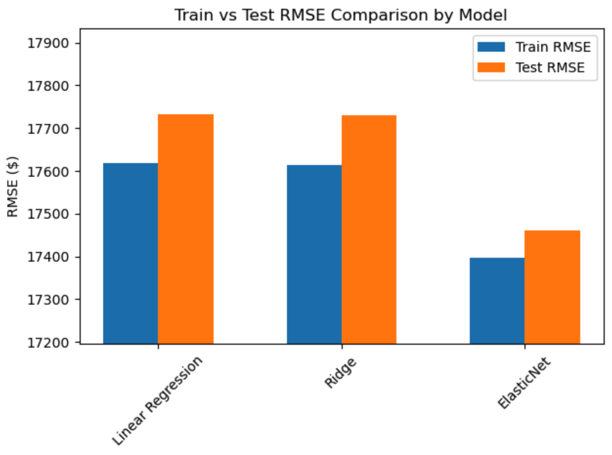
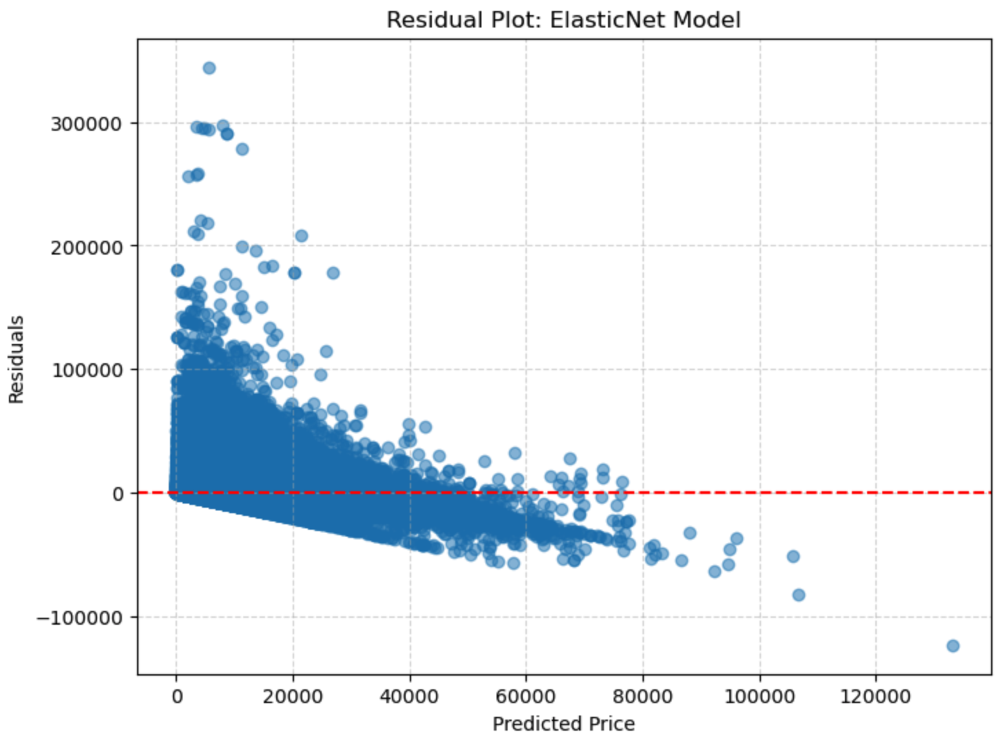
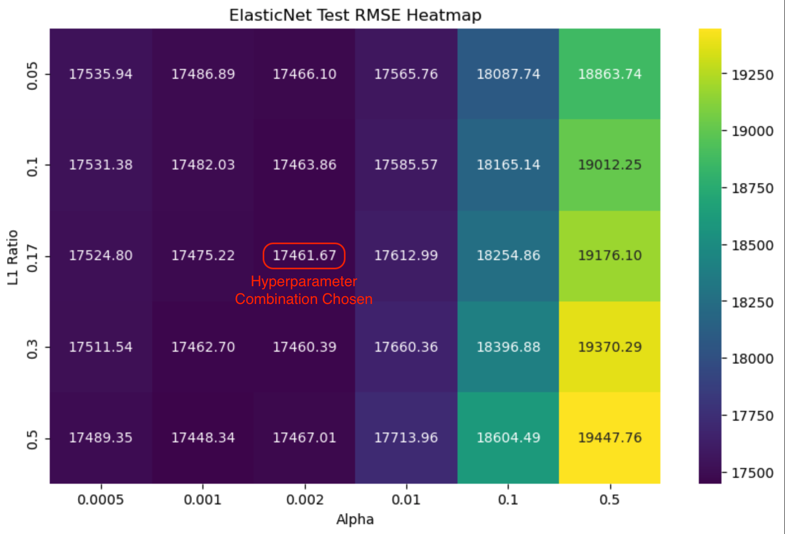

# Used Car Price Analysis and ElasticNet Modeling

## Overview

This project analyzes a large used car sales dataset to understand the factors that influence vehicle resale prices and to build predictive models. The goal is to identify key drivers of pricing, optimize model performance, and highlight opportunities for strategic vehicle acquisition and sales.

## Bottom Line Up Front

ElasticNet provided the best predictive performance while maintaining generalization. Geographic region and brand perception are the strongest drivers of resale prices. These insights can guide acquisition and sales strategies in the used car market.

## Dataset

The dataset contains ~427,000 used car listings with attributes such as:
- Vehicle characteristics: `cylinders`, `odometer`, `year`, `transmission`, `fuel`, `type`, `paint_color`
- Vehicle condition: `condition`, `title_status`
- Location: `region`, `state`
- Manufacturer and model details

## Methodology

### Preprocessing

- Numeric features: imputed with median and scaled
- Ordinal features: imputed with most frequent value, encoded with `OrdinalEncoder`
- Categorical features: imputed with 'Unknown', encoded with `OneHotEncoder`
- Custom transformation for `cylinders` to extract numeric values from text
- Log transformation applied to the target variable (`price`) to address skewness

### Modeling

- Linear Regression (baseline)
- Ridge Regression
- ElasticNet (with hyperparameter tuning)
- Models evaluated using RMSE on train and test splits

### Evaluation

- RMSE comparison across models, selected for its readability and interpretibility as compared to price in dollars
- Feature importance analysis via ElasticNet coefficients

## Findings

- **Geography:** Certain regions depress prices (e.g., Salem, Medford-Ashland, Long Island) while others drive higher resale values (e.g., Anchorage/Mat-Su, Olympic Peninsula, Bellingham)
- **Brands:** High value brands include Audi, Land Rover, Porsche, Jaguar; low value brands include Dodge, Kia, Nissan
- **Vehicle Types:** Pickup trucks command higher prices; sedans tend to underperform
- **Vehicle Features:** Missing odometer, transmission, or paint data correlate with lower prices
- **Data Gaps:** Transmission category 'Other' and fuel type 'Unknown' show unexpected trends — further data collection recommended

## Next Steps

- Explore additional feature engineering, such as interaction terms between region and vehicle type
- Collect more detailed data for unusual categories, such as 'Other' transmission or 'Unknown' fuel type, to validate observed trends
- Investigate pricing strategies across regions for market arbitrage opportunities

### Supporting Charts

